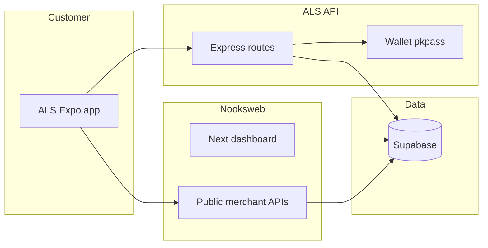

# Documentation & Codebase Review — Agent Session Handoff

**Purpose:** One place to copy a structured summary of the long-running “read the docs + both codebases” work (ALS_draft0-1 + nooksweb-1), plus operational lessons from related sessions.

**Important limits (read this first):**

- A **1,000,000-word** dump is **not technically possible** in a single model response, and it would be unusable even if it were (roughly **15+ full novels** of text).
- The **full verbatim history** of the “documentation and codebase review” agent lives in Cursor’s **agent transcript** JSONL on disk (see **§10**). That file is the ground truth for “everything that was said.”
- This document **does not paste secrets**. If API keys appeared in chat, **rotate them** and store them only in env managers — never in docs or transcripts you share.

---

## 1. How this session started (from transcript)

The user asked the agent to:

1. Read **all documentation** and the **entire codebase** for **`ALS_draft0-1`** (workspace).
2. Read **`nooksweb-1`** documentation and codebase the same way.
3. Prepare for follow-up implementation work in **both** repos.

The agent responded by exploring both projects in parallel and producing a high-level architecture summary (see **§2–3**).

---

## 2. ALS_draft0-1 — what the stack is (customer app + API)

**Role:** Customer-facing ordering app (Expo / React Native) + Node/Express API surface.

**Typical tech (as summarized in-session):**

- **Mobile:** Expo (SDK referenced in-session, e.g. SDK 54 range in conversation), React Native, Expo Router, NativeWind / Tailwind-style styling.
- **Server:** Express + TypeScript (commonly described as running on a dev port such as **3001** in docs/session notes).
- **Data/auth:** Supabase (auth + Postgres).
- **Integrations (common in this codebase):**
  - **Foodics** — menu/POS-related flows.
  - **OTO** — delivery / logistics integration.
  - **Moyasar / Tap** — payments.
  - **Mapbox** — geocoding / map-related features (exact usage evolves by branch).
- **Features discussed across the thread:** menu/cart/checkout, promos, loyalty, push notifications, Apple Pay, i18n (en/ar), merchant branding/white-label behavior.

**Docs:** Many markdown guides under `docs/` (exact count varies by branch).

**Important operational note:** Production readiness checklists exist (e.g. `docs/PRODUCTION_CHECKLIST.md`) — follow those for env, keys, and Supabase URL configuration.

---

## 3. nooksweb-1 — what the stack is (merchant SaaS)

**Role:** Merchant dashboard + public APIs consumed by the mobile app.

**Typical tech:**

- **Web:** Next.js App Router, React, Tailwind, charts (e.g. Recharts), Sentry optional.
- **Auth:** Supabase (email/password + Foodics OAuth flows described in docs).
- **Features:** merchant signup, branding wizard, billing/subscription flows, dashboard modules (orders, operations, marketing, analytics), “build trigger” integration for the mobile app build pipeline.
- **Data:** Supabase migrations + shared tables (merchant-scoped).

**Docs:** `docs/` in the nooksweb repo.

---

## 4. Major workstreams that appear in the long transcript (themes)

The transcript is large (thousands of JSONL lines; hundreds of user turns). Rather than repeating every message, these are the **recurring engineering themes** that show up:

### 4.1 Authentication change request (SMS)

**User intent:** Replace email/OTP auth with **SMS verification** using a Saudi SMS provider (`api.mobile.net.sa` / MadarSMS-style documentation).

**Agent behavior:** Attempted to fetch provider docs; when docs were incomplete via automated fetch, proceeded with common Saudi SMS API patterns and implemented server-side send/verify flows (exact endpoints/fields should be validated against the provider’s official Postman/OpenAPI doc).

**Security note:** Any API key pasted in chat should be treated as compromised; rotate and move to env vars.

### 4.2 Payments, refunds, cancellations (Moyasar + OTO + Foodics)

**Themes:**

- Prefer **void** when eligible vs **refund** (fee differences discussed).
- OTO order/shipment cancellation constraints (what can be cancelled after pickup).
- Foodics webhooks for cancellations and reconciliation.

### 4.3 Loyalty + Apple Wallet / PassKit

**Themes:**

- **Server-generated `.pkpass`**, signing certificates, PassKit payload updates.
- Pass updates vs iOS caching behavior (serial numbers, refresh semantics).
- Native module issues (`ExpoPasskitModule` / Swift `AsyncFunction` patterns) and certificate formats (PEM/PKCS8).
- Merchant-configurable wallet branding (logo scale, colors) and DB-backed fields.

### 4.4 UI / React Native styling issues

**Themes:**

- NativeWind `className` vs inline `style` precedence.
- Debugging runtime values vs stylesheet compilation.

### 4.5 “Read the codebase” meta-work

**Themes:**

- Cross-repo alignment (Nooks public API base URL in Expo env).
- Merchant ID resolution and branding fetch behavior.
- Avoiding accidental writes to Nooks-owned Supabase tables from ALS.

---

## 5. Related operational fixes (this Cursor thread / nooksweb)

These items came up around **GitHub checks**, **Vercel deploys**, and **Next.js client pages**:

### 5.1 Next.js `useSearchParams()` + Suspense

Payment success pages were split into:

- `*Content` component (hooks)
- default export page wrapping `<Suspense fallback={...}>`

This is a standard Next.js App Router requirement for client components using `useSearchParams()`.

### 5.2 Sentry + `next.config.ts`

`withSentryConfig` can fail CI builds if **Sentry org/project** are set but **auth token** is missing for upload steps. A robust approach is:

- Only enable the **Sentry webpack/build plugin** when `SENTRY_AUTH_TOKEN` is present; otherwise keep runtime Sentry via instrumentation + DSN.

### 5.3 Vercel Hobby cron limits

`vercel.json` had an **hourly** cron expression. **Vercel Hobby** restricts cron frequency (commonly **daily** on Hobby). That can fail deployments and route users to cron usage/pricing documentation.

**Fix pattern:** use a **daily** cron schedule on Hobby, or upgrade plan / move scheduled jobs elsewhere.

### 5.4 GitHub ↔ Vercel integration confusion

Symptoms included:

- “no new deployments”
- commit checks failing
- author verification / deployment protection messages (team settings)

**Operational checklist:**

- Verify GitHub account email **verified** (`github.com/settings/emails`).
- Verify Vercel GitHub connection (`Login Connections`).
- Confirm the **Vercel project** is the one connected to the repo you push.
- If checks fail, read the **failed deployment build log** (not only the GitHub UI).

---

## 6. “What to pitch / what’s left before a client” (business + technical)

This is not a transcript excerpt; it’s a practical consolidation:

**Before a first sales pitch (demo):**

- A **10-minute demo path** that always works.
- Clear **scope** of what’s included in v1 vs later.

**Before taking real money / production:**

- Production Supabase + migrations applied.
- Live payment keys (not test) where required.
- Email/SMS providers verified and budgeted.
- Monitoring (Sentry optional) and basic support playbook.

**Docs:** See `docs/PRODUCTION_CHECKLIST.md` and `docs/EVERYTHING_LEFT_FULL_STACK.md` in ALS for detailed lists.

---

## 7. Product strategy notes (external research / comparison)

The user referenced competitors (e.g. Highlight Cards-style wallet loyalty) and discussed:

- **Standalone wallet loyalty** vs **POS-integrated** loyalty.
- Points vs stamps vs cashback, and operational complexity at the cashier.
- Program changes and “sunset/grandfathering” (enterprise-style migrations).

These are **product/architecture decisions**; implement them as explicit state machines + migrations, not as “toggle switches” that rewrite customer balances unpredictably.

---

## 8. Tooling sidebar: Claude Code CLI vs Cursor extension

Installing the **VS Code/Cursor extension** does not automatically install the **`claude` terminal command**.

On Windows, typical fixes:

- Install CLI globally, e.g. `npm install -g @anthropic-ai/claude-code` (or follow Anthropic’s current installer docs).
- Ensure `C:\Users\<you>\AppData\Roaming\npm` is on PATH; restart the editor after install.

---

## 9. What this document is NOT

- Not a **verbatim** copy of every message.
- Not a replacement for **code review** / **security audit**.
- Not legal advice (privacy, payments, loyalty liability).

---

## 10. Where the full chat history actually lives (copy/paste source of truth)

If you need the **entire** transcript text as it was recorded:

- Look under **Cursor agent transcripts** for your workspace, typically:
  - `C:\Users\8cupc\.cursor\projects\<project>\agent-transcripts\<uuid>\<uuid>.jsonl`

The “documentation and codebase review” thread’s main file in this workspace is commonly named like:

- `agent-transcripts\70ea8829-7201-408e-8ff7-7956bf97bb29\70ea8829-7201-408e-8ff7-7956bf97bb29.jsonl`

That JSONL is **one JSON object per line** (role/user/assistant). You can:

- convert it to readable text with a small script, or
- open in an editor that can pretty-print JSON lines.

**Subagent transcripts** may exist under `subagents\*.jsonl` for the same conversation.

---

## 11. How to continue safely

If you want the next agent to implement features:

- Provide **repo + branch** + **environment** (prod vs staging).
- Provide **acceptance criteria** (user flows).
- Never paste secrets; use `.env.example` keys only.

---

## 12. Appendix: “Why not 1,000,000 words?”

A million words is roughly:

- ~200 hours of reading at 250 wpm, or
- ~3,000–4,000 typical blog articles.

Even a **complete transcript** of this session is **nowhere near** that size. If you need maximum detail, **use the JSONL transcript** (§10) — it is the only faithful representation.

---

## Part II — Complete `docs/` index (ALS_draft0-1)

Each file below lives under [`docs/`](.). Use this as a reading order for new contributors or for pasting into another AI context (summaries are purpose-focused; open the file for full detail).

| Document | What it covers |
|----------|----------------|
| [`AGENT_DOCUMENTATION_AND_CODEBASE_REVIEW_HANDOFF.md`](AGENT_DOCUMENTATION_AND_CODEBASE_REVIEW_HANDOFF.md) | This handoff: architecture, ops, indexes. |
| [`ANSWERS_FOR_NOOKSWEB.md`](ANSWERS_FOR_NOOKSWEB.md) | Q&A style notes aimed at nooksweb-side alignment. |
| [`APPLE_PAY_SETUP.md`](APPLE_PAY_SETUP.md) | Apple Pay merchant ID, capability, and testing notes. |
| [`BRANCH_MAPPING_NOOKS.md`](BRANCH_MAPPING_NOOKS.md) | Mapping Nooks/Foodics branches to OTO pickup codes and app config. |
| [`BUILD_WEBHOOK_EXPLAINED.md`](BUILD_WEBHOOK_EXPLAINED.md) | Conceptual explanation of the mobile build webhook from nooksweb → ALS/build service. |
| [`BUILD_WEBHOOK_SETUP.md`](BUILD_WEBHOOK_SETUP.md) | Practical setup steps for webhook URL, secret, and EAS/GitHub Actions. |
| [`EVERYTHING_LEFT_FULL_STACK.md`](EVERYTHING_LEFT_FULL_STACK.md) | Long checklist: Supabase, migrations, env, Moyasar, Resend, go-live order. |
| [`MAPS_TROUBLESHOOTING.md`](MAPS_TROUBLESHOOTING.md) | Google Maps / Mapbox issues on Android emulator vs device. |
| [`MERCHANT_CONTEXT.md`](MERCHANT_CONTEXT.md) | How `EXPO_PUBLIC_MERCHANT_ID` and future deep links determine tenant. |
| [`MESSAGE_FOR_NOOKS_AGENT_BUILD_WEBHOOK.md`](MESSAGE_FOR_NOOKS_AGENT_BUILD_WEBHOOK.md) | Message/spec fragment for the “build webhook” integration. |
| [`MESSAGE_FROM_NOOKS_AND_ALS_RESPONSE.md`](MESSAGE_FROM_NOOKS_AND_ALS_RESPONSE.md) | Cross-team message log / requirements responses. |
| [`MESSAGE_TO_NOOKSWEB_AGENT.md`](MESSAGE_TO_NOOKSWEB_AGENT.md) | Instructions to nooksweb agent (auth, env, dashboard). |
| [`MULTI_MERCHANT_ONE_APP_OR_MANY_BUILDS.md`](MULTI_MERCHANT_ONE_APP_OR_MANY_BUILDS.md) | Strategy: one white-label app vs per-merchant builds; EAS inputs. |
| [`NOOKS_ALIGNMENT_SPEC.md`](NOOKS_ALIGNMENT_SPEC.md) | **Core spec:** branches, merchant context, auth, payments, what ALS must implement for Nooks parity. |
| [`NOOKS_AND_SUPABASE.md`](NOOKS_AND_SUPABASE.md) | Shared Supabase: which tables are Nooks-owned vs ALS-owned; migration discipline. |
| [`NOOKS_BRANDING_PIPELINE.md`](NOOKS_BRANDING_PIPELINE.md) | How branding flows into headers, UI, and **wallet pass** logo resolution. |
| [`NOOKS_BUILD_AND_BRANDING_RESPONSE.md`](NOOKS_BUILD_AND_BRANDING_RESPONSE.md) | Responses on build pipeline and branding API fields. |
| [`NOOKSWEB_APIS_AND_BEHAVIOR.md`](NOOKSWEB_APIS_AND_BEHAVIOR.md) | Public nooksweb API shapes the app calls (branding, menu, orders, etc.). |
| [`NOOKSWEB_ANSWERS.md`](NOOKSWEB_ANSWERS.md) | Short answers about nooksweb behavior. |
| [`NOOKSWEB_AUTH_GET_USER_INFO.md`](NOOKSWEB_AUTH_GET_USER_INFO.md) | Auth/session: how “me” and merchant linkage work on dashboard. |
| [`NOOKSWEB_DASHBOARD_FULL_SPEC.md`](NOOKSWEB_DASHBOARD_FULL_SPEC.md) | Dashboard modules and intended UX (large spec). |
| [`NOOKSWEB_FIXES_SIGNUP_AND_FOODICS.md`](NOOKSWEB_FIXES_SIGNUP_AND_FOODICS.md) | Signup + Foodics OAuth fixes and edge cases. |
| [`NOOKSWEB_FULL_PROJECT_PROMPT.md`](NOOKSWEB_FULL_PROJECT_PROMPT.md) | Mega-prompt describing nooksweb for AI agents (env, routes, product). |
| [`NOOKSWEB_LOYALTY_WALLET_LOGO_SCALE.md`](NOOKSWEB_LOYALTY_WALLET_LOGO_SCALE.md) | DB column + API for wallet card logo scale; pass generation. |
| [`NOOKSWEB_SESSION_AND_UI_SETTINGS_IMPLEMENTATION.md`](NOOKSWEB_SESSION_AND_UI_SETTINGS_IMPLEMENTATION.md) | Cookies, SSR, session persistence patterns for Next + Supabase. |
| [`OTO_SETUP_GUIDE.md`](OTO_SETUP_GUIDE.md) | OTO credentials, pickup locations, testing. |
| [`OTO_TESTING.md`](OTO_TESTING.md) | Scenarios for delivery/cancel flows. |
| [`PAYMENT_TESTING.md`](PAYMENT_TESTING.md) | Moyasar test cards, success/failure paths. |
| [`PROMO_CODES.md`](PROMO_CODES.md) | Promo validation rules and tables. |
| [`PRODUCTION_CHECKLIST.md`](PRODUCTION_CHECKLIST.md) | **Mandatory before prod:** auth bypass off, live keys, Supabase URLs, Realtime, Apple Pay. |
| [`REMAINING_BUILD_SETUP.md`](REMAINING_BUILD_SETUP.md) | Gaps in EAS/GitHub workflow setup. |
| [`SAAS_FINANCIAL_MODEL_AND_VENDOR_MAP.md`](SAAS_FINANCIAL_MODEL_AND_VENDOR_MAP.md) | Vendor costs (Foodics, hosting, SMS, etc.) for planning. |
| [`SUPABASE_AUTH.md`](SUPABASE_AUTH.md) | Redirect URLs, deep links, email templates. |
| [`TESTING_FULL_FLOW_WITHOUT_APPLE_GOOGLE_ACCOUNTS.md`](TESTING_FULL_FLOW_WITHOUT_APPLE_GOOGLE_ACCOUNTS.md) | Using test build flags / simulator when you lack store accounts. |
| [`ULTIMATE_WORKFLOW_SPEC.md`](ULTIMATE_WORKFLOW_SPEC.md) | End-to-end merchant + customer journey (landing → wizard → billing → app). |

---

## Part III — ALS_draft0-1 repository map (where code lives)

### Client (Expo Router)

Primary screens and flows under [`app/`](../app/):

| Path | Role |
|------|------|
| `app/index.tsx` | Entry / routing to tabs or auth. |
| `app/_layout.tsx` | Root layout, providers. |
| `app/(auth)/login.tsx`, `app/(auth)/otp.tsx` | Authentication (email/OTP and/or SMS depending on branch). |
| `app/(tabs)/menu.tsx`, `offers.tsx`, `orders.tsx`, `more.tsx` | Core tabs. |
| `app/cart.tsx`, `checkout.tsx`, `order-type.tsx` | Cart and checkout. |
| `app/payment-modal.tsx`, `order-confirmed.tsx` | Payment and confirmation. |
| `app/add-address-modal.tsx`, `address-modal.tsx` | Addresses / Mapbox geocoding. |
| `app/loyalty-modal.tsx` | Loyalty UI entry. |
| `app/product.tsx` | Product detail. |
| Various `*-modal.tsx` | Support, terms, privacy, profile, order detail, favorites, contact, about. |

### Server (Express)

Routes registered from [`server/index.ts`](../server/index.ts); route modules under [`server/routes/`](../server/routes/):

| Route module | Typical responsibility |
|--------------|------------------------|
| `auth.ts` | Signup/login/OTP/SMS verification (evolved in-session). |
| `foodics.ts` | Foodics proxy/sync patterns. |
| `oto.ts` | OTO dispatch, status, cancel. |
| `payment.ts` | Moyasar/Tap intents, server-side payment validation. |
| `orders.ts` | Order creation, listing, linkage to `customer_orders`. |
| `loyalty.ts` | Points balance, earn/redeem API surface. |
| `walletPass.ts` | Generate/sign **Apple Wallet** `.pkpass`. |
| `googleWallet.ts` | Google Wallet equivalents if enabled. |
| `build.ts` | Build webhook receiver / validation. |
| `complaints.ts`, `support.ts` | Customer support paths. |

Supporting code: [`server/services/`](../server/services/) (OTO, payment, Foodics, SMS), [`server/lib/`](../server/lib/) (SMS wallet, merchant integrations), [`server/utils/`](../server/utils/) (auth helpers, nooks internal).

---

## Part IV — Supabase migrations (ALS_draft0-1), chronological meaning

Files under [`supabase/migrations/`](../supabase/migrations/). **Run in timestamp order** on the target project.

| File | Intent (short) |
|------|------------------|
| `20260216000000_create_promo_codes.sql` | Base promo table (legacy/overlap with nooksweb must be checked). |
| `20260217000000_create_profiles.sql` | User profiles linked to `auth.users`. |
| `20260217100000_create_email_otp.sql` | Email OTP storage (pre-SMS era). |
| `20260218000000_create_customer_orders.sql` | Persisted orders for logged-in users. |
| `20260218000001_create_als_promo_codes.sql` | ALS-specific promo table if split from generic promos. |
| `20260307000000_create_sms_otp.sql` | SMS OTP storage / rate limits (abuse protection). |
| `20260308000000_refunds_complaints.sql` | Refunds/complaints support schema. |
| `20260312000000_full_system_migration.sql` | Consolidated or bulk schema step (review before applying on prod with data). |
| `20260314000000_loyalty_system.sql` | Core loyalty tables/config. |
| `20260315000000_team_members.sql` | Team/merchant staff (if applicable). |
| `20260321000000_loyalty_wallet_card_logo_scale.sql` | Wallet logo scale column for PassKit assets. |
| `20260328180000_pitch_readiness_hardening.sql` | Security/readiness hardening for pitch. |
| `20260328203000_branch_loyalty_member_profiles.sql` | Branch loyalty member identity / lookup. |

Always reconcile with **nooksweb migrations** if both share one Supabase project — avoid duplicate tables and conflicting RLS.

---

## Part V — nooksweb-1 API surface (App Router `route.ts`)

Repo path: `c:\Users\8cupc\nooksweb-1` (not always inside ALS workspace). Below is a **grouped** index of API routes for orientation (see each file for methods and auth).

**Auth / account**

- `app/api/auth/foodics/route.ts`, `callback/route.ts`, `check-verified-and-signin`, `resend-verification`, `post-login-route`
- `app/api/me/route.ts`, `signup/create-merchant`, `invite/*`, `auth/callback`

**Billing / Moyasar**

- `billing/initiate-payment`, `verify-payment`, `finalize-subscription`, `send-receipt`
- `webhooks/moyasar`

**Dashboard (merchant session)**

- `dashboard/orders`, `orders/[orderId]/cancel`, `orders/[orderId]/status`
- `dashboard/commerce`, `operations`, `complaints`, `team`, `subscription`, `merchant-id`
- `dashboard/loyalty`, `loyalty/branch`, `loyalty/rewards`, `loyalty/upload-logo`
- `dashboard/sms-wallet`, `initiate-payment`, `finalize-payment`

**Public (customer app)**

- `public/discover`, `public/merchants/[merchantId]/branding`, `menu`, `branches`, `banners`, `operations`, `orders`, `orders/[orderId]`
- `public/merchants/[merchantId]/promos`, `validate`, `use`
- `public/orders` (create public order where applicable)

**Integrations / jobs**

- `foodics/sync`, `webhooks/foodics`
- `cron/subscription-renewals` (paired with `vercel.json` schedule; **Hobby = daily max**)
- `build/trigger`, `push/send`, `health`

**Debug (remove or lock down in production)**

- `debug/resend-status`, `send-test-email`, `supabase-config`

---

## Part VI — Environment variables (ALS) — expanded

Client-exposed (`EXPO_PUBLIC_*`) — visible in the built app; never put secrets here.

| Variable | Purpose |
|----------|---------|
| `EXPO_PUBLIC_API_URL` | ALS Express base URL (device: use LAN IP). |
| `EXPO_PUBLIC_MAPBOX_TOKEN` | Geocoding / address search. |
| `EXPO_PUBLIC_MOYASAR_PUBLISHABLE_KEY` | Card payment UI. |
| `EXPO_PUBLIC_APPLE_PAY_MERCHANT_ID` | Apple Pay on iOS. |
| `EXPO_PUBLIC_MERCHANT_ID` | Nooks merchant UUID (multi-tenant). |
| `EXPO_PUBLIC_NOOKS_API_BASE_URL` | Live nooksweb / Vercel URL for branding, branches, public APIs. |
| `EXPO_PUBLIC_GOOGLE_MAPS_API_KEY` | Native maps on Android (and iOS if used). |
| `EXPO_PUBLIC_SUPABASE_URL` / `EXPO_PUBLIC_SUPABASE_ANON_KEY` | Supabase client. |
| `EXPO_PUBLIC_SKIP_AUTH_FOR_DEV` | **Dev only** — must be off in production. |

Server-only (examples; see `server/loadEnv.ts` and routes): `SUPABASE_SERVICE_ROLE_KEY`, `MOYASAR_SECRET_KEY`, OTO tokens, Foodics tokens, SMS keys, `NOOKS_INTERNAL_SECRET`, PassKit certificates, APNs keys, etc.

---

## Part VII — Cross-repo flow (high level)



---

## Part VIII — Transcript themes (deeper index)

The Cursor JSONL transcript for the long “documentation & codebase review” session contains **hundreds of user turns** and touches **at least** these engineering areas (non-exhaustive):

- **SMS provider integration** (`api.mobile.net.sa`): SendSMS patterns, server-side verification, replacing email OTP.
- **Payment economics:** Moyasar void vs refund; when each applies.
- **OTO lifecycle:** cancel order vs cancel shipment; pickup states.
- **Foodics:** webhooks, menu sync, branch identity.
- **Loyalty:** DB fields, pass generation, PassKit signing, barcode payload, merchant logo sizing, iOS invalid pass debugging (cert chain, PKCS#8 vs RSA PEM).
- **Expo / native:** Swift module bridges, `AsyncFunction` patterns.
- **Styling:** NativeWind precedence, debugging runtime style resolution.
- **Branding pipeline:** menu card vs header color, API fallbacks, caching in the app.
- **Build pipeline:** EAS, GitHub Actions, `EXPO_PUBLIC_MERCHANT_ID` injection.
- **Cross-repo env:** pointing `EXPO_PUBLIC_NOOKS_API_BASE_URL` at production Vercel.

For **verbatim** quotes and every file touched in that session, use the JSONL export (§10 of the original sections above).

---

## Part IX — Operational runbooks

### A. “Deploy succeeded but app looks wrong”

1. Confirm `EXPO_PUBLIC_NOOKS_API_BASE_URL` in the **built** binary (not only `.env` on disk).
2. Hard-close app; clear AsyncStorage if your branch caches branding.
3. Verify merchant UUID and nooksweb branding API response in a REST client.

### B. “Payments work in dev but not prod”

1. Switch Moyasar to **live** keys on server + matching publishable key in app.
2. Verify webhook URLs and secrets on Moyasar dashboard.
3. Check Supabase RLS and service role usage only on server.

### C. “Vercel deploy fails”

1. Read the **build log** line that fails (not only GitHub’s red X).
2. Check **Hobby cron** limits if the error mentions crons.
3. Check **Sentry** `withSentryConfig` if failures mention source maps or auth token.
4. Next.js: ensure `useSearchParams` pages use **Suspense** boundaries.

### D. “GitHub shows Vercel failed but I see no new deployment”

1. Confirm repo connection and **production branch** name.
2. Verify commit author email vs GitHub/Vercel accounts (Hobby private repo rules).
3. Confirm GitHub App permissions for the Vercel integration.

---

## Part X — Security checklist (condensed)

- [ ] No `EXPO_PUBLIC_SKIP_AUTH_FOR_DEV` in production builds.
- [ ] No service role keys in client bundles.
- [ ] Rotate any API key ever pasted into chat or committed to git.
- [ ] Lock down `debug/*` routes on nooksweb in production.
- [ ] RLS policies reviewed for `customer_orders`, profiles, loyalty tables.
- [ ] Webhook endpoints validate signatures (Moyasar, Foodics, internal build secret).

---

## Part XI — Testing matrix (smoke)

| Area | Smoke test |
|------|------------|
| Auth | Sign up → verify → login → logout |
| Order | Browse → cart → checkout → pay (test card) → order visible |
| OTO | Create delivery order → track → cancel before pickup (if applicable) |
| Loyalty | Balance changes → wallet pass download → pass updates after action |
| Nooks API | Branding JSON matches dashboard settings |
| nooksweb | New merchant signup → wizard → dashboard loads |

---

## Part XII — Glossary

| Term | Meaning |
|------|---------|
| **ALS** | This customer app + API repo (`ALS_draft0-1`). |
| **Nooks / nooksweb** | Merchant dashboard + public APIs (Next.js on Vercel). |
| **Path A** | Centralized Apple Developer account signing passes for many merchants (concept from product discussions). |
| **PassKit** | Apple’s wallet pass format (`.pkpass`). |
| **OTO** | Delivery integration layer used in-app. |
| **Foodics** | POS/menu ecosystem; source of truth for many merchants. |
| **Moyasar** | Payment gateway used for cards/subscriptions. |
| **RLS** | Row Level Security in Supabase Postgres. |
| **Hobby (Vercel)** | Free tier; strict cron frequency limits. |

---

## Part XIII — Exporting the Cursor JSONL to plain text (Windows)

In PowerShell (adjust the path to your transcript file):

```powershell
Get-Content "C:\Users\8cupc\.cursor\projects\c-Users-8cupc-ALS-draft0-1\agent-transcripts\<uuid>\<uuid>.jsonl" | ForEach-Object { ($_ | ConvertFrom-Json).message.content[0].text } | Set-Content -Encoding utf8 transcript_plain.txt
```

If `content` is not always text-only, parse more defensively or use jq-like filtering. The JSONL can be **very large**.

---

## Part XIV — What to update next in this handoff

When you ship major features, append:

- New migrations and their **rollback notes**.
- New public API routes on nooksweb.
- New env vars in `.env.example`.
- Any **breaking** changes to branding or loyalty payloads.

---

## Part XV — nooksweb-1 dashboard & marketing pages (file index)

Routes under `nooksweb-1/app/**/page.tsx` (Next.js App Router). Use for UX reviews and QA scripts.

| Route file | Likely purpose |
|------------|----------------|
| `app/page.tsx` | Landing / marketing home. |
| `app/login/page.tsx`, `signup/page.tsx`, `forgot-password/page.tsx`, `reset-password/page.tsx` | Auth flows. |
| `app/auth/confirm/page.tsx` | Email confirmation handler. |
| `app/verify-email/page.tsx` | Email verification UX. |
| `app/wizard/page.tsx` | Post-signup branding wizard. |
| `app/billing/page.tsx`, `app/billing/success/page.tsx` | Moyasar subscription checkout + success (Suspense-wrapped). |
| `app/invite/page.tsx` | Team invite acceptance landing. |
| `app/app-icon/page.tsx` | App icon generation / preview tool. |
| `app/privacy/page.tsx`, `app/terms/page.tsx`, `app/refund/page.tsx` | Legal / policy. |
| `app/(dashboard)/dashboard/page.tsx` | Main dashboard home. |
| `app/(dashboard)/dashboard/orders/page.tsx` | Order list / ops. |
| `app/(dashboard)/dashboard/operations/page.tsx` | Operations / live status. |
| `app/(dashboard)/dashboard/marketing/page.tsx` | Banners / marketing. |
| `app/(dashboard)/dashboard/analytics/page.tsx` | Analytics charts. |
| `app/(dashboard)/dashboard/complaints/page.tsx` | Complaints inbox. |
| `app/(dashboard)/dashboard/loyalty/page.tsx` | Loyalty program config. |
| `app/(dashboard)/dashboard/loyalty/branch/page.tsx` | Branch staff loyalty tools. |
| `app/(dashboard)/dashboard/team/page.tsx` | Team members. |
| `app/(dashboard)/dashboard/settings/page.tsx` | Settings hub. |
| `app/(dashboard)/dashboard/settings/appearance/page.tsx` | Branding / appearance. |
| `app/(dashboard)/dashboard/settings/sms-wallet/page.tsx` | SMS wallet billing settings. |
| `app/(dashboard)/dashboard/settings/sms-wallet/success/page.tsx` | SMS wallet payment success (Suspense). |
| `app/(dashboard)/dashboard/help/page.tsx` | Help. |

---

## Part XVI — ALS_draft0-1 `src/` layer (client architecture)

### API clients (`src/api/`)

| Module | Integrates with |
|--------|-----------------|
| `client.ts` | HTTP client base URL / headers. |
| `auth.ts` | ALS auth endpoints. |
| `supabase.ts` | Supabase client wrapper. |
| `foodics.ts` | Foodics proxy usage. |
| `oto.ts` | Delivery (OTO). |
| `payment.ts` | Moyasar client flows. |
| `orders.ts` | Order creation/history. |
| `loyalty.ts` | Points / wallet. |
| `nooksBranches.ts`, `nooksBanners.ts`, `nooksMenu.ts`, `nooksOrders.ts`, `nooksOperations.ts`, `nooksPromos.ts` | **Nooks public HTTP API** for multi-tenant data. |
| `mapbox.ts` | Geocoding / search (Google vs Mapbox per branch). |
| `push.ts` | Push registration. |
| `support.ts` | Support tickets/messages. |

### Context providers (`src/context/`)

| Context | Responsibility |
|---------|------------------|
| `AuthContext.tsx` | Session / user. |
| `MerchantContext.tsx` | Current merchant id resolution. |
| `MerchantBrandingContext.tsx` | Colors, logos, menu card — **critical for white-label**. |
| `CartContext.tsx` | Cart state. |
| `MenuContext.tsx`, `OrdersContext.tsx`, `OperationsContext.tsx` | Feature domains. |
| `ProfileContext.tsx`, `SavedAddressesContext.tsx`, `FavoritesContext.tsx` | User prefs. |

### Notable components

| Path | Notes |
|------|------|
| `src/components/apple-wallet/AppleWalletAddPassButton.tsx` | Entry to download pass; ties to ALS API wallet route. |
| `src/components/order/OrderTrackingMap.tsx` | Maps + tracking. |
| `src/config/branchOtoConfig.ts` | Static OTO / branch mapping — must stay aligned with Nooks (`docs/BRANCH_MAPPING_NOOKS.md`). |

---

## Part XVII — Extended FAQ (onboarding another engineer)

**Q: Which repo do I change for merchant dashboard UI?**  
A: `nooksweb-1` (Next.js). ALS is the customer app only.

**Q: Where is the Apple Wallet pass built?**  
A: Server-side in ALS (`server/routes/walletPass.ts`) with certificates on the server; branding fields often come from Nooks/Supabase loyalty config.

**Q: Why are there two promo systems in migrations?**  
A: Historical evolution + nooksweb overlap. Before applying migrations on a shared DB, diff against existing tables.

**Q: What breaks multi-tenant demos most often?**  
A: Wrong `EXPO_PUBLIC_MERCHANT_ID`, wrong `EXPO_PUBLIC_NOOKS_API_BASE_URL`, or cached branding in AsyncStorage.

**Q: Where do I test payments safely?**  
A: Moyasar test keys + `docs/PAYMENT_TESTING.md`. Never use test keys in production.

**Q: Why did Vercel send me to cron pricing docs?**  
A: Hobby tier cannot schedule crons more than once per day; hourly cron in `vercel.json` fails the deployment.

**Q: How do I get the full agent chat as text?**  
A: Export JSONL per Part XIII; the handoff cannot duplicate every token of conversation.

---

## Part XVIII — “Maximum length” note

This file is now structured to be **long and navigable** (hundreds of lines): indexes, tables, runbooks, glossary, and repo maps.  

If you need **even more**, the highest-signal expansion is **not** repeating prose—it is:

1. Pasting **key sections** from `docs/NOOKSWEB_FULL_PROJECT_PROMPT.md` and `docs/EVERYTHING_LEFT_FULL_STACK.md` into an internal wiki, or  
2. Maintaining a **CHANGELOG.md** per repo with dated decisions, or  
3. Running the JSONL export and keeping `transcript_plain.txt` under version control **locally only** (redact secrets).

---

## Part XIX — nooksweb-1 Supabase migrations (file list)

Location: `nooksweb-1/supabase/migrations/`. Apply in **timestamp order** on the target project. Names encode intent; read each file before running on production.

1. `20260217000001_create_merchants.sql`
2. `20260217000002_create_app_config.sql`
3. `20260217000003_storage_merchant_logos.sql`
4. `20260217100000_dashboard_tables.sql`
5. `20260217100001_banners_bucket.sql`
6. `20260217100002_dashboard_tables_only.sql` (variant — see doc notes)
7. `20260217100003_trigger_create_merchant_on_signup.sql`
8. `20260217100004_foodics_subscription_tier.sql`
9. `20260217100005_app_config_delivery_mode.sql`
10. `20260217100006_audit_log.sql`
11. `20260219100000_orders_branch_delivery.sql`
12. `20260219110000_promo_codes_public_view.sql`
13. `20260220100000_banners_placement.sql`
14. `20260222000000_app_config_background_color.sql`
15. `20260222100000_orders_driver_location.sql`
16. `20260222200000_subscriptions.sql`
17. `20260222200001_product_categories.sql`
18. `20260222200002_increment_promo_usage.sql`
19. `20260226000000_push_subscriptions.sql`
20. `20260228090000_promo_codes_image.sql`
21. `20260228090500_app_config_busy_started_at.sql`
22. `20260228120000_app_config_surface_text_colors.sql`
23. `20260302050000_app_config_app_name_icon.sql`
24. `20260307120000_app_config_icon_bg_color.sql`
25. `20260308000000_app_config_tab_text_color.sql`
26. `20260308000001_merchants_go_live_fields.sql`
27. `20260309000000_app_config_logo_scales.sql`
28. `20260325000000_team_members_branch_operations.sql`
29. `20260326110000_saas_branch_billing_and_integrations.sql`
30. `20260327160000_sms_wallet.sql`
31. `20260328123000_sms_wallet_otp_charge_15_halalas.sql`
32. `20260328150000_subscription_renewals.sql`
33. `20260328193000_foodics_menu_hardening.sql`

**ALS migrations** (separate folder in this repo) must be reconciled with these when using **one** Supabase project — see `docs/NOOKS_AND_SUPABASE.md` and `docs/EVERYTHING_LEFT_FULL_STACK.md`.

---

---

## Part XX — Claude Code Session (2026-03-29, ~5 hours)

### Session Summary

Major implementation session covering loyalty system overhaul, Foodics adapter integration, and comprehensive auditing across both repos. All changes pushed to GitHub.

### 1. Loyalty System Redesign (complete overhaul)

**Three loyalty systems implemented** — merchant picks ONE in the dashboard:
- **Cashback**: % per SAR spent, real SAR balance, redeemable at checkout + branch
- **Points**: points per SAR with configurable value, redeemable at checkout + branch
- **Stamps**: 1 stamp per order, milestones (max 5) with Foodics menu items as rewards, redeemable at branch via Foodics POS + in-app

**Key architectural decisions:**
- Soft-transition via `config_version` instead of Retire & Launch programs
- No tiers (Bronze/Silver/Gold removed)
- 1 stamp = 10 internal points (Foodics never sees these — internal accounting only)
- Branch Loyalty sidebar page hidden (not needed with Foodics adapter)

**New database migration**: `20260330000000_loyalty_three_systems.sql`
- `loyalty_config`: added `loyalty_type`, `cashback_percent`, stamp card design fields, `config_version`, banner URL
- New tables: `loyalty_stamp_milestones`, `loyalty_stamp_redemptions`, `loyalty_cashback_balances`
- Config versioning columns on `loyalty_points`, `loyalty_stamps`, `loyalty_transactions`

### 2. Foodics Loyalty Adapter (replaces wrong coupon approach)

**Problem found**: Initial implementation created Foodics discount coupons via `POST /v5/discounts`. This is wrong — Foodics uses an **adapter pattern** where their POS calls OUR endpoints.

**Correct implementation** (Foodics official adapter pattern):
- `POST /api/adapter/v1/reward` — Foodics POS calls when cashier scans QR. Returns reward type 1 (cashback/points as order discount) or type 2 (stamps as product discount with allowed_products)
- `POST /api/adapter/v1/redeem` — Foodics POS calls after applying reward. Deducts balance/stamps via ALS, captures `date` + `user_id` for audit, validates `redeemed_products` against milestone products
- `POST /api/adapter/v1/verify_otp` — Placeholder for future OTP support
- Auth: `NOOKS_ADAPTER_ACCESS_TOKEN` in Bearer header

**QR code changed**: From Code128 with member_code to PKBarcodeFormatQR with Foodics JSON:
```json
{"customer_name":"Ahmed","customer_mobile_number":"548548545","mobile_country_code":966}
```

**Files deleted**: `lib/foodics-coupons.ts`, `app/api/loyalty/create-stamp-coupon/route.ts`, `app/api/dashboard/loyalty/retire-and-launch/route.ts`

**Registration required**: Email Foodics support@foodics.com to register as loyalty adapter partner.

### 3. Foodics Order Creation Fixes

- Added UUIDv4 `id` field (Foodics requirement)
- Added `customer_dial_code` (966 for Saudi)
- Fixed modifier structure: `{modifier_option_id, quantity, unit_price}` instead of `{id}`
- Added `meta.external_number` for receipt printing
- Added price validation via `POST /orders_calculator` before creating
- Fixed delivery address to flat fields (`customer_address_name/description/latitude/longitude`)
- Fixed charge structure: `amount` instead of `value`

### 4. Foodics Menu Sync Fixes

- Updated product includes: `category,tax_group,branches,modifiers,modifiers.options,modifiers.options.branches,groups`
- Added branch-specific pricing (pivot.price stored as `branch_prices_json`)
- Inactive products set as `is_hidden: true`
- Modifier options sorted by `index`, inactive options filtered
- Combo/bundle support via `/combos` endpoint
- Fetches `/settings` for `tax_inclusive_pricing`, `rounding_level`, `rounding_method`, `currency`, `timezone`
- `per_page=250` for larger menus

### 5. Webhook Fixes

- Numeric Foodics order status codes 1-8 mapped
- Delivery status codes 1-6 mapped
- `menu.updated` event triggers catalog re-sync
- Delivery status resolution from `body.delivery_status`

### 6. Order Calculation Formulas

- Implemented Foodics tax-inclusive formulas in `app/checkout.tsx`
- Items and delivery fee extracted from inclusive prices separately
- Rounding to nearest halala (0.01 SAR)

### 7. Loyalty Dashboard (nooksweb)

- Complete rewrite of `app/(dashboard)/dashboard/loyalty/page.tsx`
- Type selector (cashback/points/stamps) with conditional config sections
- Stamp milestone editor with Foodics menu item picker (searches `/products`)
- Wallet card designer: 3 live previews (stamp grid, cashback card, points card)
- Banner + logo upload, stamp box/icon color pickers
- Adaptive expiry label per loyalty type

### 8. ALS Server Changes

- Earn endpoint branches by `loyalty_type` (cashback/points/stamps)
- New endpoints: `redeem-cashback`, `cashback-balance`, `stamp-milestones`, `redeem-stamp-milestone`
- Both `redeem` and `redeem-cashback` accept user auth OR internal secret (for adapter + app)
- Cron: cashback expiry, stamp expiry, type-aware push notifications
- Wallet pass: 3 layouts, QR code as Foodics JSON, no tiers

### 9. Comprehensive Auditing

Multiple audit rounds identified and fixed:
- 12 loyalty issues (cashback checkout flow, milestone detection, null safety, etc.)
- 13 Foodics compliance issues (UUID, calculator, modifiers, settings, etc.)
- 3 adapter spec issues (Type 3 documentation, date/user_id capture, product validation)
- Auth bug: redeem-cashback was internal-secret-only, blocking app checkout

### 10. Foodics Merchant Requirements

- **Advanced plan** (API included) OR **API license add-on** on Starter/Basic (~40 SAR)
- Tiers: Starter 423 SAR/mo, Basic 801 SAR/mo, Advanced 1,224 SAR/mo
- Nooks pays Foodics: $250/month for 0-25 accounts, $8/account/month for 26+
- Required scopes: `general.read`, `orders.get`, `orders.limited.create`, `orders.limited.pay`, `orders.limited.deliver`, `orders.limited.decline`

### 11. New Environment Variables

- `NOOKS_ADAPTER_ACCESS_TOKEN` — Foodics sends this when calling adapter endpoints

### 12. Git Commits (this session)

All commits pushed to GitHub under `Nooks-tech` org:
- **ALS_draft0** (`master`): ~10 commits — loyalty overhaul, adapter QR, checkout fixes, cron updates, auth fixes
- **nooksweb** (`main`): ~10 commits — loyalty page, adapter endpoints, order/sync fixes, webhook hardening

---

*Generated as a handoff summary. Update as the product evolves. Last updated 2026-03-29 (evening).*
